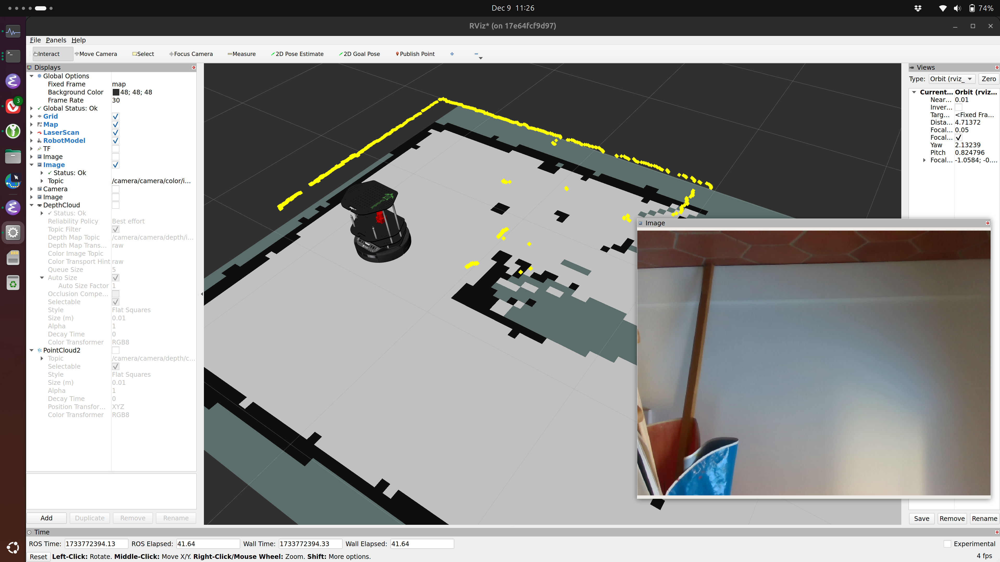

Inspired by Julien Enoch's presentation on Eclipse Zenoh ([meeting on 2024-11-04](/meetings)) and our attempts two weeks later to test Zenoh as a ROS 2 middleware ([meeting on 2024-12-02](/meetings)), I decided to upgrade my Turtlebot2 reference platform to use Zenoh. In particular, I wanted to duplicate the existing ability to control the robot using RViz from a separate computer.

## tl;dr
All files can be found at <https://github.com/ingotrobotics/turtlebot2_ros2/tree/feature/zenoh>. Issues, pull requests, and all other commentary are encouraged.

## Background
Before I jump in, let me provide some background on my reference platform. I use a Turtlebot2 (built on the [Kobuki platform](https://github.com/kobuki-base/kobuki_core)) with a [Hokuyo URG](https://www.hokuyo-aut.jp/search/single.php?serial=166) planar laser scanner for navigation. An [Intel RealSense D435](https://www.intelrealsense.com/depth-camera-d435/) camera provides RGB and depth images, and an Intel NUC provides the compute. The robot runs ROS 2 Humble, Iron, or Jazzy from a Docker container. There is no ROS installed natively on the robot. Not all of the Turtlebot2 packages are available as `apt` packages, so part of the container building process involves building those packages from source. Containers are built by a Jenkins instance and hosted on a private Docker registry. More details can be found in the [Dockerfile](https://github.com/ingotrobotics/turtlebot2_ros2/blob/main/turtlebot2_ros2.dockerfile).

## Add Zenoh to Container
To add Zenoh support to the container, I added the following lines to my Dockerfile:
```
# Install Zenoh
RUN mkdir -p "$ROBOT_WORKSPACE/src" && \
    git clone https://github.com/ros2/rmw_zenoh.git "$ROBOT_WORKSPACE/src/rmw_zenoh"
RUN apt-get update && \
    rosdep install --from-paths ./src -y --ignore-src && \
    rm -rf /var/lib/apt/lists/*
RUN source "/opt/ros/$ROS_DISTRO/setup.bash" && \
    colcon build --cmake-args -DCMAKE_BUILD_TYPE=Release
	
# Set ROS to use Zenoh as the middleware 
RUN echo "export RMW_IMPLEMENTATION=rmw_zenoh_cpp" >> /root/.bashrc && \
    echo "export RUST_LOG=info" >> /root/.bashrc
```

Like in the [meeting on 2024-12-02](/meetings), I am referencing the [Zenoh ROSCon workshop materials](https://github.com/ZettaScaleLabs/roscon2024_workshop). As you see in that meeting, I was able to get communication working between three containers on the same machine, but I was not able to get communication to work between two separate machines. So after building Zenoh support into the Turtlebot container, I started at [Exercise 2](https://github.com/ZettaScaleLabs/roscon2024_workshop/blob/main/exercises/ex-2.md). The key step here is copying and editing the router configuration file. 

I spent a lot of time sorting out why the config file in the workshop materials was not running before I realized it had been updated recently and the update introduced a [bug](https://github.com/ZettaScaleLabs/roscon2024_workshop/issues/12) for the version of Zenoh I installed. This is a nice reminder that while version 1.0.0 has been released, `rmw_zenoh` is still under quite a bit of active development.

If you've never switched away from the default ROS2 DDS middleware, it can be easy to forget to set the `RMW_IMPLEMENTATION` environment variable, which is what actually makes the switch happen. This has to be done in every Bash instance if changing away from the default. `ros2 doctor --report` will show the active ROS middleware. Common alternatives to `rmw_zenoh_cpp` are `rmw_fastrtps_cpp`, `rmw_fastrtps_dynamic_cpp`, or `rmw_cyclonedds_cpp`.

## Network Topology
For my reference platform, the topology of a router running on each device (robot and developer computer) is a great setup and is shown in this diagram: [](https://github.com/ZettaScaleLabs/roscon2024_workshop/blob/main/exercises/pictures/talker-listener-2-containers.png). Not every system will need or benfit from this topology, but in my case, the configuration is very simple and it also simplifies the ROS 2 network traffic between my two devices.

For this topology, only one device needs to use the customized config file that provides the address of the other device. With my reference platform, I typically use one robot but multiple development devices or containers, which means I should have the config file on the development devices providing the address of the robot. I mentioned earlier that the robot does not have a native ROS installation, and neither do my development devices; they run container images built using the same Dockerfile as the robot only they are based on the `-desktop` [images provided by OSRF](https://hub.docker.com/r/osrf/ros/tags). This means that I'll have the default config file copied to the appropriate location in the Dockerfile, and setting the necessary environment variable (`ZENOH_ROUTER_CONFIG_URI`) for Zenoh to use it will happen in the command to launch the development container.

Copying the router config file adds one more line to the Dockerfile:
```
RUN mkdir -p "$ROBOT_WORKSPACE/zenoh_confs" && \
    cp "$ROBOT_WORKSPACE/src/rmw_zenoh/rmw_zenoh_cpp/config/DEFAULT_RMW_ZENOH_ROUTER_CONFIG.json5" "$ROBOT_WORKSPACE/zenoh_confs/ROUTER_CONFIG.json5"
```

It would not be good practice for me to publish the IP address of my robot on GitHub, even for a reference implementation, so I have replaced it with an environment variable, `ZENOH_TARGET` that is specified as part of the `docker run` command. Since I don't know enough about how Zenoh parses the config file, I use `sed` to replace the value in the config file rather than leaving the Bash environment variable:
```
sed -i "s|// \"<proto>/<address>\"|\"$ZENOH_TARGET\"|" "$ROBOT_WORKSPACE/zenoh_confs/ROUTER_CONFIG.json5"
```
This is brittle because the default config file is likely to change as Zenoh develops and as more ROS users migrate to it. If you have a better way to accomplish this, I'd be interested in seeing it.

## Launching Zenoh Router and ROS Nodes
One last challenge is that I am launching the Zenoh router separately from my other launch files, which requires running two processes in the container. It looks like there is on-going work to simplify this in the `rmw_zenoh` repos.

To accomplish launching the router and my other ROS processes in a "quick and dirty" manner, I have written a [little script](https://github.com/ingotrobotics/turtlebot2_ros2/blob/feature/zenoh/background_zenoh_router.sh) to run the router in the background. This script also handles the address replacement from the environment variable passed in when starting the container. These commands should probably be incorporated into the robot's launch file, and I should write a launch file incorporating these commands for launching RViz as well. Look for that improvement soon.

## So does it work?
Mostly. Here's a screenshot of RViz showing the robot, laser scans, map, and RGB camera output. 
I was able to drive the robot using `teleop_twist_keyboard`, but I was not able to use RViz to successfully send a goal point.

There are some issues starting up the Nav2 stack, and relaunching will sometimes produce different errors. Here are two samples:
```
[lifecycle_manager-17] [INFO] [1733773169.631170992] [lifecycle_manager_navigation]: Waiting for service bt_navigator/get_state...
[lifecycle_manager-17] [INFO] [1733773171.631518706] [lifecycle_manager_navigation]: Waiting for service bt_navigator/get_state...
```
```
[opennav_docking-16] [ERROR] [1733772743.456351127] [rmw_zenoh_cpp]: topic name /tf_static not found in topic_map. Report this.
[opennav_docking-16] [ERROR] [1733772743.457680837] [rmw_zenoh_cpp]: topic name /tf_static not found in topic_map. Report this.
```
I need to look into these and see if the issue can be solved in my launch file and configuration or if there are deeper bugs that should be reported to the package maintainers.

## Do I get any benefits?
Yes, I get one really big benefit, but it comes with some drawbacks. First, the big benefit is that I can remove `--network=host` from the `docker run` commands and replace with `-p 7447:7447`. Restricting the accesible ports (and devices) to the minimum required reduces the potential security attack surface, so this is good. Explicitly calling out the necessary ports also makes it easier to run multiple containers on the same host, which is also good.

The biggest drawback is that Nav2 doesn't run out-of-the-box any more. I expect this to be resolved fairly quickly, since there is plenty of attention and momentum on using Zenoh for ROS.

The other major drawback is that the docker images are much larger now: A Zenoh-enabled image is 11 GB, which is around 6 GB larger than the image without Zenoh. Disk space isn't the constraint is used to be, but this is a significant increase and a barrier for adoption in low-cost, mass-market robots.

Another small personal benefit is that as a part of this work, I updated the Jenkinsfile to include Git branch names in the container tags. This was an open issue, and it feels good to close it.

## Commands and Files
All files can be found at <https://github.com/ingotrobotics/turtlebot2_ros2/tree/feature/zenoh>. Issues, pull requests, and all other commentary are encouraged.

To run the container on my robot, I use a command like
```
$> docker run -it --rm -p 7447:7447 --device=<robot_hardware> $CONTAINER_NAME
```
And once inside the container:
```
$> ./background_zenoh_router.sh
$> source install/setup.bash
$> ros2 launch turtlebot2_bringup turtlebot2_bringup.launch.py
```

On the developer device, I use rocker to run RViz in the container, so the container commands look like
```
$> rocker --x11 --device=/dev/dri/card0 --port=7447:7447 --volume="$HOME"/.rviz2:/root/.rviz2 --env='ZENOH_TARGET="tcp/<robot address>:7447"' $CONTAINER_NAME
```
and then
```
$> ./background_zenoh_router.sh
$> source install/setup.bash
```
Followed by either `rviz2` or `ros2 run teleop_twist_keyboard teleop_twist_keyboard`.

## Future Work
In the future, I would like to setup a Zenoh cloud router that can be used to demo the platform when I don't want to bring my robot (and separate wifi router) with me. I also plan on switching to an NVidia Jetson Nano for the on-robot compute.
